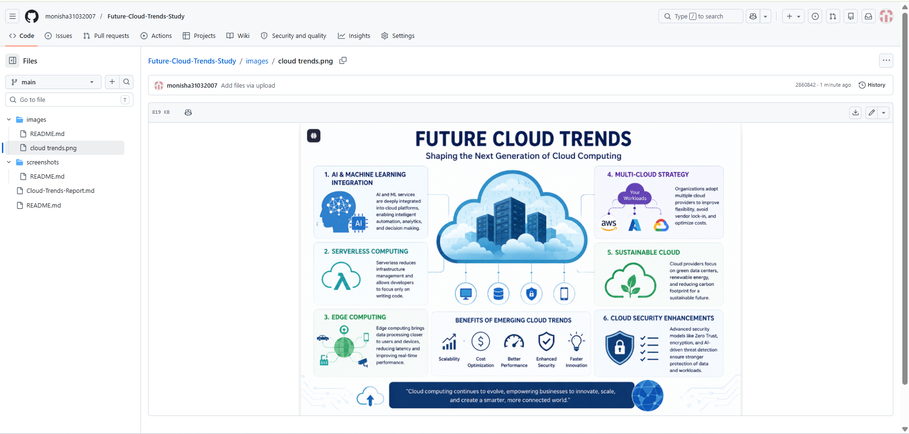
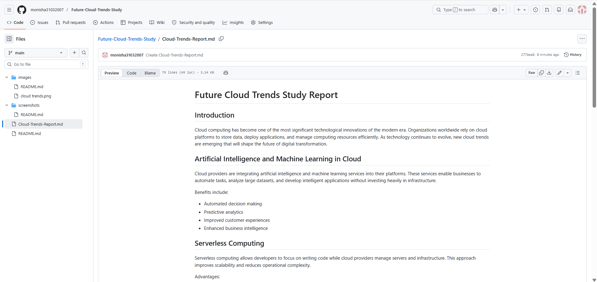

# Future Cloud Trends Study

## Intern Information

**Name:** Monisha S
**Intern ID:** CITS2080
**Domain:** Cloud Computing

## Overview

Cloud computing continues to evolve rapidly, transforming the way organizations develop, deploy, and manage applications. This project explores emerging trends that are shaping the future of cloud computing and examines their potential impact on businesses and technology.

## Objectives

* Study emerging cloud technologies.
* Analyze future trends in cloud computing.
* Understand industry adoption patterns.
* Explore challenges and opportunities in modern cloud environments.

## Emerging Cloud Trends

### 1. Artificial Intelligence and Machine Learning Integration

Cloud providers are increasingly integrating AI and ML services into their platforms, enabling organizations to build intelligent applications with minimal infrastructure management.

### 2. Serverless Computing

Serverless architectures allow developers to focus on code while cloud providers manage infrastructure automatically.

### 3. Edge Computing

Edge computing processes data closer to users and devices, reducing latency and improving application performance.

### 4. Multi-Cloud Strategy

Organizations use multiple cloud providers to improve reliability, flexibility, and cost optimization.

### 5. Sustainable Cloud Computing

Green cloud initiatives focus on reducing energy consumption and environmental impact through efficient data centers.

### 6. Cloud Security Enhancements

Advanced security models such as Zero Trust Architecture help organizations protect cloud resources and sensitive information.

## Benefits

* Improved scalability
* Enhanced security
* Reduced operational costs
* Faster innovation
* Better disaster recovery

## Future Scope

Future cloud platforms will leverage AI-driven automation, quantum computing integration, intelligent security systems, and highly distributed edge infrastructure.

## Conclusion

Cloud computing will continue to drive digital transformation worldwide. Emerging technologies such as AI, serverless computing, edge computing, and sustainable cloud solutions will define the next generation of cloud services.

## Author

Monisha S

## Project Screenshots

### Repository Homepage

### Research Report

## Cloud Trends Infographic

